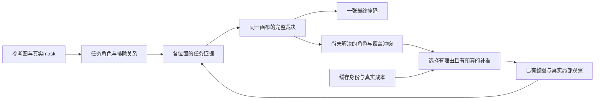

# 从区域收益到任务、观察与完整掩码的共同机制

当前应该保留的是已经实测有效的真实局部表示和同场景身份判断，并研究它们怎样服务于同一张最终掩码。参考定义任务，当前任务判断产生需要补看的位置，补看的证据返回同一个决策场。三个环节共同决定完整输出；单独增加参考门控、减少窗口或追加 CRF，都已有不足或负结果。

本轮机制研究使用已封存资产，三轨并行研究，新增 DINO 编码、模型权重、训练、样本与布局搜索均为 0。另先前授权的PACO600已按原冻结配方完成，现只基于全部封存结果作评价诊断。以下明确区分已经算出的诊断、已经实现的接口与尚未验证的分割候选。

## 已有收益与两项新诊断

|证据|结果|对机制的约束|
|---|---|---|
|LVIS 已封存 600，原区域方法|原图 class mIoU 52.005138，完整 FoRIS 47.779371，Z2 50.234597，同 K 几何 49.744750|身份选择具有超出同 K 几何的收益；这是已曝光开发集，尚非独立跨场景确认。|
|DeepGlobe 已封存 100|FoRIS 29.377542；原区域 37.023712；取消九局部 CRF 的快九窗 37.344028|当前可保留的强对照是快九窗。道路单前景合并 IoU 与 LVIS class mIoU 不混比。|
|同 Deep100 从整图特征插值九窗|27.546345，相对真实快九窗 −9.797683|已有整图 O24 的这项替换未保分；真实裁剪同时改变尺度、上下文和位置，不能只归因于分辨率。|
|同 Deep100 上中下快3窗|32.738801，相对快九窗 −4.605226|覆盖中央50%的这项布局未保分，不代表所有三窗布局都失败。|
|**新：固定3/9输出的空间编辑分解**|覆盖外两侧 +4.071735 点（88.4%）；中央 +0.533492 点（11.6%）|这次损失主要在未增强两侧；中央改变主要减少 FP。此为输出空间贡献，未隔离重叠、局部内容和判别的因果贡献。|
|**新：完全保持快九窗输出的精确早停**|100/100 最终掩码逐字节一致；平均8.87窗，只省13/900个局部视野（1.44%）|固定几何 greedy 下，单给现有多数规则加早停，成本收益很小；不是所有观察顺序的最优下界。|
|**更新：PACO600快九窗**|原图class/fold mIoU34.971403，对同批FoRIS38.460868低3.489466，四fold全负|该快版未在部件任务保分；原有局部CRF的区域法在PACO尚未测，不能把两个版本混成同一跨集结论。|

空间分解的两侧贡献探索95%区间为 [2.894509,5.313752]，中央为 [.160586,.966537]。仅两侧换成已保存九窗输出得到36.757354，但这张诊断掩码已经用了九窗结果，不能作为可部署三窗方法。精确早停5窗后平均95.156%像素已确定，8窗后99.656%；最后少量未决位置仍需要整窗编码。像素确定比例不等于保住同等比例的 IoU。

实际成本也支持把问题放在这里：相同前5例、MPS FP32 B1、模型已加载，快九窗完整均值22.487750秒，快3窗10.570706秒，共享整图版9.423473秒。后两项的速度收益伴随已测分数损失。去局部 CRF 已成功消除一类重复计算，剩余真实局部编码需要由更好的任务判断与观察分配决定。

来源：[LVIS600](/Users/misaya.yanghejazfs.com.au/paper_project/cv_data/a/lvis_component_completion600_20261009/REPORT.md)、[Deep100](/Users/misaya.yanghejazfs.com.au/paper_project/cv_data/a/deepglobe_component100_20261009/REPORT.md)、[空间分解](/Users/misaya.yanghejazfs.com.au/paper_project/cv_data/a/unified_mechanism_research_20261010/observation_attribution/REPORT.md)、[精确证书](/Users/misaya.yanghejazfs.com.au/paper_project/cv_data/a/unified_mechanism_research_20261010/prototype/exact_fast9_certificate_summary.json)。

## 一、什么算目标：保留参考任务内部的区别

单张参考 mask 指定这张图里的正位置和排除位置，没有直接告诉我们类名、父物体身份或查询目标的完整形状。全物体、部件、区域都使用同一条件：查询哪些位置符合参考的正角色，并能与参考的负角色区分。推理时不按查询 GT 面积或数据集标签判断任务类型。

现有8连通组件是候选范围。部件和相连父物体可能落在同一组件，多个不连通部分也可能属于同一目标。因此最终决策单位应保留组件内部 token / 子区域，不把连通性当作任务身份。当前一个面积均值、一个 margin、一个 keep 位会丢掉这些内部差异。

准备 `TaskRelationBank` 保留原始参考 O24、实际 mask 的连续 patch 覆盖 c、纯 FG / 纯 BG / mixed 标记、近 BG 的四邻接与 coverage 改变的网格边，以及输入和 mask 身份。c>0 的 fractional FG 必须保留；没有纯 FG 时明确记录，而不舍弃细目标。近 BG 只是参考中被排除的邻接位置，不称已识别的父物体。相似 BG 见证可作下一阶段字段，当前先不增加 F×B 语义检索成本。

该 bank 保存任务区别，尚未提供已验证的迁移解码器。廉价双均值读出 `r=q·(mu_F−mu_B)/2` 只用于首次有界接口：单位化角色均值存在时 r∈[−1,1]。它可能再次压缩多模态与粒度信息，不能被写成最终答案。无 FG/BG 质量或均值方向不可用时返回缺失，不能凭空制造角色证据。

两份真实参考缓存的接口验收已完成：DeepGlobe首例`dg18-0000`有723个mixed、0个纯FG，前景覆盖质量209.98828125全部来自mixed；LVIS首例`dev_s1/lvis/0/29`有4个纯FG、15个mixed，前景质量12.82421875中8.82421875来自mixed（约68.8%）。两例不能给出数据集频率，但已说明只保留纯FG可能把一个合法细结构任务全部删除。原始O24的父流程单位化、mask独立覆盖公式和NPZ重读均逐位一致，bank构建分别23.16ms/16.51ms；原始缓存读取另耗1.576s/.218s，不能把构建时间当完整处理成本。

已有负结果必须进入设计：LVIS200 参考整窗门控38.230低于完整 FoRIS45.809，774个空窗仍通过582个；在有效 query 门控上追加参考 AND 仅+.142且探索区间跨0。旧 matched BG 重加权完整49.109783也低于同预算 uniform49.765735。因此需要验证**保留区域内部与参考关系是否改变正确的完整决策**，不能把另一个参考平均值硬门控当作创新。

## 二、需要看见什么：由未解决的任务判断驱动观察

真实局部输入提供更密的物理采样，也改变上下文及位置编码。共享整图 O24 插值没有补充原编码中缺失的观测；该负结果只约束已测替换，不能排除更好的共享编码设计。当前缓存只有实际保存的 O24 末层和实际输入视野，不包含任意新尺度、其它层或任意裁剪的编码。

观察请求保留具体理由：

- **细节请求**：参考支持主要来自 mixed token，或候选内部存在相反角色支持，需要能区分这些位置的真实采样。
- **覆盖请求**：正证据到达视野边界、在边界外尚无充分任务判断，需要跨越该边界观察。
- **上下文请求**：局部任务支持与整图伪角色、或两个已有视野互相冲突，需要观察能解释这种冲突的环境。

这些都是合法输入可形成的信号，尚未证明它们预测了实际涨分。尤其不能只增强原全图已预测 FG：已有严重漏检区域会被永久遗漏。观察策略必须保留整张画布的未知状态。Deep100空间诊断说明检查未增强覆盖很有必要，但其 GT 空间分布不能成为在线选择依据。

先以原九个真实窗口为固定可用集合。新位置、新尺度或参考额外视野目前只在设计中，不自动编码。缓存可揭示“合法信号能否使下一次观察改变任务判断”；不按未观察窗口的真实结果或 GT 选择最有收益窗口。

## 三、怎样形成完整掩码：一次共同裁决，再反馈补看

候选原型在共同1024画布上保留每个位置的有符号任务证据。真实参考身份项、已有局部提议、同场景 query 伪 FG/BG 项分别记录来源。全图 FoRIS 角色仍有实测价值，但其伪 BG 只能作为有限上下文证据：漏掉目标会污染伪 BG，原硬否决不能自动成为任务定义。

没有局部提议只表示该提议器没有看到；它不是独立的背景身份证据。最终仍需要实际任务负证据限制 FP，不能简单把所有局部背景改成弃权后期待涨分。初版允许同一组件里正负角色并存，提议只提供支持范围和已有上下文 margin。

作为**明确、尚未验证的首个读出假设**，全图证据 `e0=r0`；局部 `ev=(rv + 1_proposal * bv)/2`，其中 `bv=现有query-context margin/2`。单位特征核密度 margin 的理论范围为[−2,2]，故两项均有界。局部提议外仍可计算参考角色场；若没有该场，只能明确缺失，不从旧 keep 位编造证据。等权与全图/局部预算都是设计假设，不是零参数、校准概率或已经证明的最佳强度。

最终只判一次：

`D(p) = Σ_v alpha_v(p) * ev(p)`；`mask(p) = [D(p)>0]`。

全部证据恰好为0时按预先声明的完整 FoRIS fallback；不事后选 epsilon。它等价于独立像素二元最小二乘能量 `Σ alpha_v*(z−ev)^2`，没有后端 CRF 或硬连通标签约束。可以表达组件内部不同角色，但尚不能保证细边界、孔洞或目标完整性。若之后加空间耦合，需要重新验证求解与观察证书；独立像素的保证不能直接套到图能量上。

同一实际 input+readout 身份只记一次。局部族在每位置总预算固定为1，即 `alpha_v=coverage_v / full_universe_coverage`，全图身份项另有固定预算1。预算限制重复意见的累计影响，没有估计不同窗口的真实相关性或可靠性。重叠窗口仍可能共同犯错。

已看证据和为 D，未看预算和为 U，则该固定公式的最终场属于 `[D−U,D+U]`。不跨0的位置已确定；跨0的位置需要更多判断。下一观察按覆盖的未决预算除以实际/明确声明成本选择。选择、停止与最终输出共用这个判决场。全部位置确定即可停止，并保持**新公式全观察版本**的输出；这个数学保证不等于保持旧快九窗37.344。

新公式可能仍需看完九窗，也可能在错误身份上一致；它不能凭一致性诊断所有语义错误。已完成的旧规则精确早停1.44%节省说明：需要让参考身份在冲突位置真正起作用，并验证其新增代价与删真/删假的收支。大幅省计算的结论不能只由早停公式推出。

## 实现状态与研究验收

已实现 [bounded_mask.py](/Users/misaya.yanghejazfs.com.au/paper_project/cv_data/a/unified_mechanism_research_20261010/prototype/bounded_mask.py)，13项小数组不变量通过：完整二元能量、未知区间、重复输入不加票、缺提议不自动当 BG、有限伪 BG 可被其它证据推翻、组件内部可分以及合法选择 / 停止。它是决策合同，尚非真实分割实验。

已实现 [task_relation_bank.py](/Users/misaya.yanghejazfs.com.au/paper_project/cv_data/a/unified_mechanism_research_20261010/prototype/task_relation_bank.py)和上述两份合法参考验收，并以[unified_readout.py](/Users/misaya.yanghejazfs.com.au/paper_project/cv_data/a/unified_mechanism_research_20261010/prototype/unified_readout.py)接到有界裁决。新增5项集成检查通过：余弦对比正确缩放至[-1,1]、组件统一伪BG反对下成员角色仍可分、未提议保留实际任务场、缺失角色不编造证据、接入后的已确定标签在全部极端未看补全中不翻转。没有真实query预测或新评分。

这条廉价双均值与有界融合是接口对照。参考排除关系尚未被实现成有效的query粒度/边界迁移，线性融合也不能单独作为论文机制贡献；应在这个同一接口内验证更完整的任务关系读出，避免只给普通融合换名称。

已完成的两项真实缓存诊断分别读取已封存 mask / 已曝光评价标签和已封存 mask / 组件决定；前者新增固定输出的 I/U，后者不读取 GT。两者没有重跑模型、前端或 CRF，耗时分别1.59秒、2.86秒。参考 bank 的两例接口验收只读取合法 reference mask 和已缓存原始 O24，不读 query GT。

下一科学比较使用同一冻结身份读出与完整裁决，在已有缓存上先封存所有候选预测，再按原口径计算配对 I/U。需要一起回答：组件内部角色变化补了多少真、添了多少假；新观察顺序看几窗、实际总增量成本多少；LVIS / DeepGlobe / PACO是否使用同一公式仍有净收益。PACO600已完成，它的新阶段诊断提供必要的部件失败边界。这里没有另启数据集、扩数量或安排参数网格。

**当前结论：** 已定位旧管线可操作的限制，并建立把任务、观察、裁决连接起来的可检验接口；尚未拿到这套新候选保住收益、降低端到端成本、跨场景成立的分数证据。原快九窗保留为可追溯比较对象，版本和跨任务失败边界分别报告。

PACO600补充诊断已进一步约束假设：未筛选快版九窗多数29.538809，区域筛选追回5.432594点到34.971403。前一组合阶段的完整计价同时显示新增非目标−8.519205点、丢真目标−8.288295点，不能统一说成特征不够细；筛选去假+6.675223、删真−1.242629，整体正确但存在个别硬拒绝。600例中22.014%canonical目标无任何局部提案，另21.274%有raw局部支持却不足原始多数。部件与父mask可通过官方annotation关联，目标内部混杂和query伪角色错误有可检查证据。详见[PACO阶段报告](/Users/misaya.yanghejazfs.com.au/paper_project/cv_data/a/paco_fast9_600_20261009/analysis/stage_attribution/REPORT.md)。旧快版现在是有明确跨任务失败边界的比较对象；新的共同机制尚未经过真实分数验证。

三轨原稿：[目标与粒度](/Users/misaya.yanghejazfs.com.au/paper_project/cv_data/a/unified_mechanism_research_20261010/target_relation.md)、[观察分解](/Users/misaya.yanghejazfs.com.au/paper_project/cv_data/a/unified_mechanism_research_20261010/observation_attribution/REPORT.md)、[完整裁决](/Users/misaya.yanghejazfs.com.au/paper_project/cv_data/a/unified_mechanism_research_20261010/joint_mask.md)。
